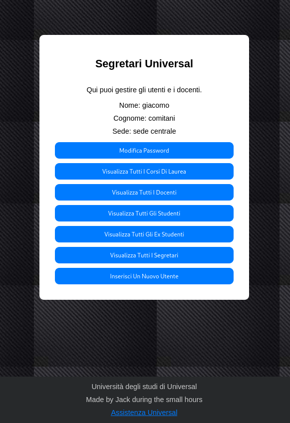

Giacomo Comitani, Matricola 986596

- [Database](#database)

- [Implementazioni Significative](#implementazioni-significative)

- [Funzioni Realizzate](#funzioni-realizzate)


# Database

Lo schema ER è disponibile cliccando [qui](ER.png)

Lo schema logico è disponibile cliccando [qui](./SchemaLogico.png)

# Implementazioni Significative

## Struttura webapp

La Webapp è composta da numerosi file `php` composti da una parte `HTML` che si occupa di dare struttura alla pagina, e una parte `php` che le conferisce delle funzionalità specifiche. Ecco un esempio di come ho gestito una pagina della webapp. 

```php
<?php
include '../scripts/db_connection.php';
session_start();

if (!isset($_SESSION['email'])) {
    header("Location: /login.php");
    exit();
}

if ($_SERVER["REQUEST_METHOD"] == "POST") {
    $vecchia_password = $_POST['old_password'];
    $nuova_password = $_POST['new_password'];

    $query_change_password = "CALL universal.change_password($1, $2, $3)";
    $result_change_password = pg_query_params($conn, $query_change_password, array($_SESSION['id'], $vecchia_password, $nuova_password));

    if (!$result_change_password) {
        echo '<script type="text/javascript">alert("Error: Errore durante il cambio password");</script>';
        exit;
    }

    echo '<script type="text/javascript">alert("Error: Password cambiata con successo"); </script>';
}
?>
```

```html
<!DOCTYPE html>
<html>
<head>
    <title>Modifica Password</title>
    <link rel="stylesheet" type="text/css" href="./changePassword.css">
</head>
<body>
    <div class="sfondo">
        <div class="contenitore">
            <div class="logo">
                    <a class="nav-link" id="uni" aria-current="page" href="/login.php">Universal</a>
                    <br>
                    <br>
                    <br>
            </div>
            <br>
            <br>
            <div class="home">
                    <a class="nav-link" id="home" aria-current="page" href="./index.php">Home</a>
            </div>
            <br>
            <br>
            <div class="titolo"><h3>Modifica Password</h3></div>
            <div class="modifica">
                <form method="POST" action="">
                    <div class="form-group">
                        <input id="old_password" class="form-control input-lg typeahead top-buffer-s" name="old_password" type="password" class="form-control bg-transparent rounded-0 my-4" placeholder="Old Password" aria-label="Email" aria-describedby="basic-addon1">
                        <br>
                        <input id="new_password" class="form-control input-lg pass" name="new_password" type="password" class="form-control  bg-transparent rounded-0 my-4" placeholder="New Password" aria-label="Username" aria-describedby="basic-addon1">
                        <br>
                        <button type="submit" class="btn btn-primary btn-lg btn-block">Change</button>
                    </div>
                </form> 
            </div>
        </div>
    </div>
    <footer>
        <div>
            Università degli studi di Universal
        </div>
        <div>
            Made by Jack during the small hours
        </div>
        <div>
            <a href="https://google.com">Assistenza Universal</a>
            <br>
        </div>
    </footer>
</body>
</html>
```

Questo codice si occupa di gestire la pagina che permette ad un utente di cambiare la propria password. 

## Login

Il file login.php si occupa di gestire l'autenticazione degli utenti nel sistema. Quando un utente inserisce le sue credenziali e preme il pulsante di login, il sistema verifica se le credenziali sono corrette. Se sì, l'utente viene reindirizzato alla sua area personale in base al tipo di account (studente, ex-studente, docente o segretario). Se le credenziali sono errate, viene mostrato un messaggio di errore.

Una volta effettuato l'accesso al sistema, l'utente può usufruire delle diverse funzionalità disponibili, in base al suo tipo di account.

<p align="center">
  
</p>

```php
if(isset($_POST["email"]) && isset($_POST["password"])) {
        $email = $_POST["email"];
        $password = $_POST["password"];
        $_SESSION['email'] = $email;
        
        $result = pg_query_params($conn, 'SELECT * FROM universal.utenti WHERE email = $1 AND password = crypt($2, password)', array($email, $password));

        if (pg_num_rows($result) == 1) {
            $query_get_id = "SELECT * FROM universal.get_id($1)";
            $result_get_id = pg_query_params($conn, $query_get_id, array($_SESSION['email']));
            $row_get_id = pg_fetch_assoc($result_get_id);
            $_SESSION['id'] = $row_get_id['id'];
            $type = Get_type($email);
            print_r($type);
            switch ($type){
                case "studenti":
                    header("Location: /progetto/webapp/studente/index.php");
                    exit();
                case "exstudenti":
                    header("Location: /progetto/webapp/ex_studente/index.php");
                    exit();
                case "docenti":
                    header("Location: /progetto/webapp/docente/index.php");
                    exit();
                case "segretari":
                    header("Location: /progetto/webapp/segreteria/index.php");
                    exit();
            }
        } else {
            echo '<script type="text/javascript">alert("Error: Credenziali errate!");</script>';
        }
    }
```

# Funzionalita' webapp

## Studente

Nel caso di uno studente, Questo verrà inizialmente reindirizzato alla seguente pagina: 

<p align="center">
  
</p>

Da qui ogni studente ha a disposizione una serie di funzionalità: 

- Visualizzare tutti gli appelli del corso di laurea al quale è iscritto

<p align="center">
  
</p>

- Visualizzare gli appelli di tutti i cordi presenti nel sistema 

- Visualizzare tutti i corsi di laurea e i rispettivi insegnamenti

<p align="center">
  
</p>

- Visualizzare gli esami mancanti alla laurea 

<p align="center">
  
</p>

- Visualizzare le iscrizioni attive agli esami 

<p align="center">
  
</p>

- Visualizzare la propria carriera, intesa come l'inseme delle valutazioni finali ottenute per ogni esame dato

- Visualizzare la propria carriera completa, intesa come l'elenco di tutte le valutazioni ottenute per ogni esame dato, compresi tutti i tentativi 

# Docenti

Gli utenti che si identificano come docenti hanno accesso a piu' funzioni rispetto a quelle accessibili agli studenti. Un docente che effettua il login al sistema viene reindirizzato inizialmente ala seguente pagina: 

<p align="center">
  
</p>

Le funzionalità a disposizione del docente sono le seguenti: 

- Modificare la propria password 

<p align="center">
  
</p>

- Visualizzare gli insegnamenti di cui il docente è responsabile

<p align="center">
  
</p>

- Per ogni insegnamento, visualizzarne gli appelli

<p align="center">
  
</p>

- Per ogni appello, visualizzare gli studenti iscritti

<p align="center">
  
</p>

- Assegnare una valutazione ad uno studente iscritto ad un appello

- creare un nuovo appello

- Visualizzare tutte le valutazioni assegnate 

<p align="center">
  
</p>

## Segretari

I segretari sono gli utenti con maggior potere all'interno del sistema, dato che lo possono gestire completamente.

Inizialmente vengono reindirizzati alla pagina iniziale della loro arera personale: 

<p align="center">
  
</p>

Da qui un segretario puo'come di consueto modificare la propria password, ma anche gestire studenti e docenti. 

Ecco una lista delle principali funzionalita':

- Visualizzare tutti i corsi di laurea 

<p align="center">
  
</p>

- Visualizzare gli insegnamenti del corso 
- Creare un nuovo corso di laurea 

<p align="center">
  
</p>

- Visualizzare gli appelli dell'insegnamento
- Modificare il responsabile dell'insegnamento
- Visualizzare, se presenti, le propedeuticita' dell'insegnamento 
- Creare nuovi appelli e visualizzarne gli studenti iscritti

<p align="center">
  
</p>
- Visualizzare tutti i docenti

<p align="center">
  
</p>

- Visualizzare i corsi di cui il docente e' responsabile 
- Visualizzare tutte le valutazioni che il docente ha assegnato 
- Eliminare il docente dal sistema. In questo caso, il docente potra' essere eliminato solamente se non ci sono all'interno del sistema insegnamenti di cui e' responsabile 
- Modificare la password del docente
- Visualizzare tutti gli studenti
- Visualizzare tutti gli studenti presenti nel sistema

<p align="center">
  
</p>

Inoltre, per ogni studente, hanno a disposizione numerose funzionalita' che gli permettono di gestirlo opportunamente. 

<p align="center">
  
</p>

In particolare, per ogni studente un segretario e' in grado di : 

- Visualizzare la carriera
- Visualizzare la carriera completa
- Visualizzare gli apelli a cui e' iscritto 
- Iscrivere/disiscrivere uno studente ad un appello
- Disiscrivere uno studente da un corso di laurea ( `Laureato`, `Rinuncia`)
- Iscrivere uno studente ad un corso di laurea 
- Visualizzare gli esami mancabti alla laurea dello studente
- Modificare la password dello studente

I segretari hanno a disposizione una schermata da cui possono visualizzare tutti gli ex studenti presenti nel sistema

<p align="center">
  
</p>

I segretari possono poi visualizzare tutti i segretari presenti nel sistema 

<p align="center">
  
</p>

Infine, I segretari hanno la possibilità di inserire un nuovo utente all'interno del sistema, specificandone il nome, il cognome, il tipo e la password

<p align="center">
  
</p>

# Funzioni Realizzate

## Funzioni

- `login`: verifica le credenziali dell'utente e ne restituisce il tipo e l'id
- `genera_matricola` : genera e ritorna il numero di matricola di uno studente 
- `get_all_students` : ritorna tutti gli studenti presenti nel sistema
- `get_all_exstudents` : ritorna tutti gli ex studenti presenti nel sistema
- `get_all_teachers` : ritorna tutti i docenti presenti nel sistema
- `get_id`: restituisce l'id dello studente a partire dai dati di autenticazione ? 
- `get_student` : restituisce uno studente dato il suo id
- `get_teacher`: restituisce un docente dato il suo id
- `get_ex_student` : restituisce un'ex studente dato il suo id 
- `get_secretary` : restituisce un segretario dato il suo id 
- `get_secretaries` : restituisce tutti i segretari presenti nel sistema 
- `get_degree_courses` : restituisce tutti i corsi di laurera presenti nel sistema 
- `get_degree_course` : restituisce un corso di laurea dato il suo codice 
- `get-email` : genera una nuova email per un utente. In caso di omonimia aggiunge un suffisso numerico incrementale alla fine del cognome dell'utente
- `get_teaching` : restituisce tutti gli insegnamenti presenti nel sistema
- `get_teaching_of-cdl` : dato il codice di un corso di laurea presente nel sistema, restituisce tutti gli insegnamenti del corso
- `get_exam-sessions` : dato il codice di un insegnamento, ne restituisce tutti gli appelli presenti nel sistema
- `get_all_exam-sessions` : restituisce tutti gli appelli di tutti gli insegnamenti presenti nel sistema 
- `get_student_exam_enrollments` : dato l'id di uno studente, restituisce tutti gli appelli a cui è iscritto 
- `get_exam_enrollments` : dato il codice di un appello, restituisce tutti gli studenti ad esso iscritti
- `get_grades` : dato il codice di un appello, restituisce tutte le valutazioni ad esso relative
- `get_grades_of_ex-students` : dato l'id di un ex studente, restituisce tutte le sue valutazioni
- `get_grades_of_ex_students` : restituisce tutte le valutazioni di tutti gli ex studenti presenti nel sistema 
- `get_missing_exams_for_graduation` : dato l'id di uno studente, restituisce gli esami che gli mancano al conseguimento della laurea a cui è iscritto 
- `get_teaching_activity_of_professor` : dato l'id di un docente, restituisce tutti gli insegnamenti di cui è responsabile
- `get_students_enrolled_in_teaching_appointments` : dato l'id di un docente, restituisce tutti gli studenti iscritti ad appelli degli insegnamenti di cui il docente è responsabile
- `get_teacher_grades` : dato l'id di un docente, restituisce tutte le valutazioni da lui assegnate
- `get_all_teaching_appointments_for_student_degree` : dato l'id di uno studente, restituisce tutti gli appelli di tutti gli insegnamenti del corso di laurea a cui è iscritto 
- `get_student_grades` : dato l'id di uno studente, restituisce tutte le sue valutazioni
- `get_student_average` : dato l'id di uno studente, restituisce la media delle sue valutazioni
- `get_all_cdl` : restituisce tutti i corsi di laurea presenti nel sistema 
- `get_partial_carrer` : dato l'id di uno studente, restituisce la sua carriera
- `get_propaedeutics` : dato il codice di un insegnamento, restituisce le sue propedeuticità
- `get_single_teaching` : dato il codice di un insegnamento, ne restituisce le informazioni associate
- `get_teaching_of_cdl_for_propaedeutics` : dato il codice di un corso di laurea e quello di un insegnamento del corso di laurea, restituisce tutti gli altri insegnamenti del corso di laurea
- `get_all_students_of_cdl` : dato il codice di un corso di laurea presente nel sistema, restituisce tutti gli studenti ad esso iscritto 

## Procedure

- `studentToExStudent` : trasforma uno studente in un ex studente, aggiornando correttamente le tabelle del sistema
- `insert_utente` : dato il nome, il cognome, la password e il tipo, inserisce un nuovo utente nel sistema
- `delete_utente` : dato l'id di un utente presente nel sistema, lo elimina
- `insert_degree_course` : inserisce un corso di laurea nel sistema 
- `insert_teaching` : inserisce un insegnamento nel sistema 
- `insert_exam_session` : inserisce un appello di un insegnamento presente nel sistema
- `subscription` : iscrive uno studente ad un appello 
- `insert_grade` : assegna una valutazione ad uno studente
- `subscribe_to_cdl` : iscrive uno studente ad un corso di laurea presente nel sistema 
- `change_password` : modifica la password di un utente presente nel sistema 
- `unsubscribe_from_exam_appointment` : disiscrive uno studente dall'appello di un insegnamento 
- `unsubscribe_from_exam_appointment` : disiscrive uno studente da un appello presente nel sistema 
- `unsubscribe_to-cdl` : disiscrive uno studente da un corso di laurea presente nel sistema 
- `create_exam_session` : crea un appello d'esame di un insegnamento
- `delete_exam_session` : cancella l'appello d'esame di un insegnamento
- `change_course_responsible_teacher` : modifica il docente responsabile di un insegnamento
- `change_secretary_office` : modifica la sede di un segretario 
- `delete_secretary` : elimina un segretario presente nel sistema 
- `delete_techer` : elimina un docente presente nel sistema 
- `insert_propaedeutics` : crea la propedeuticità per un'insegnamento

## Trigger

- `aggiorna_tabella` : inserisce le informazioni dell'utente creato nella tabella corretta, in base al tipo
- `elimina_utente_dopo_cancellazione` : elimina le informazioni dell'utente eliminato,  nella tabella `utenti`
- `check_number_of_session` : controlla che non ci sia piu di un appello nella stessa data per lo stesso corso di laurea
- `check_subscription_to_cdl` : controlla che uno studente non sia già iscritto ad un corso di laurea 
- `non_cyclic_prerequisites_check` : controlla che non ci siano propedeuticità cicliche 
- `check_instructor_course_limit`: controlla che il docente responsabile dell'insegnamento non sia giè responsabile di almeno tre insegnamenti
- `check_prerequisites_before_enrollment` : controlla che siano  rispettate le propedeuticità all'iscrizione ad un'appello.