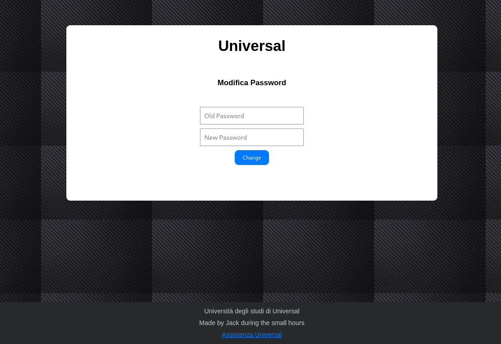
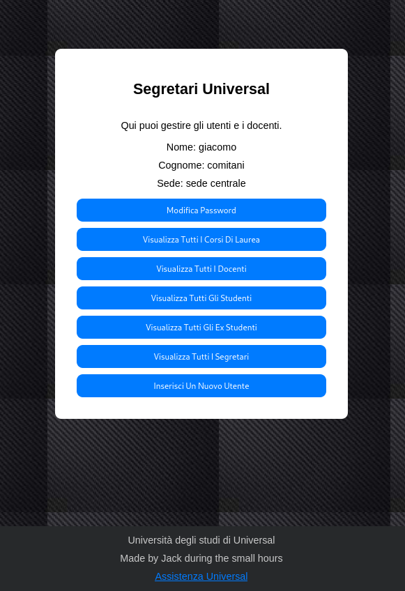
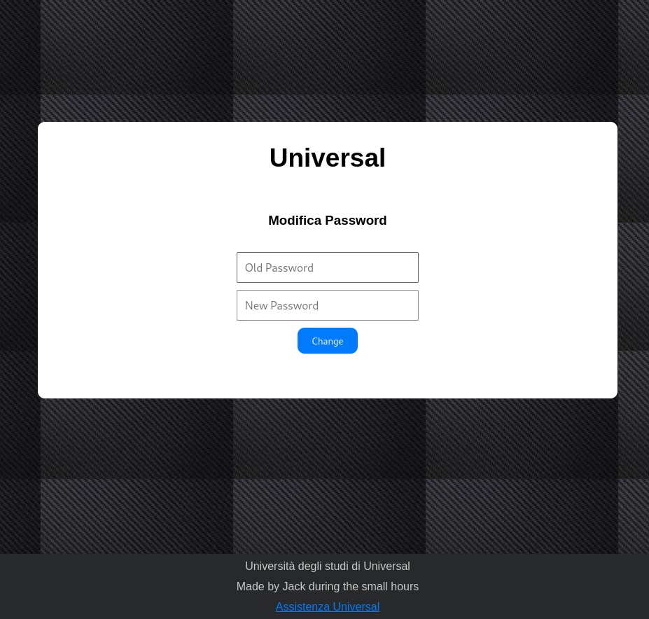
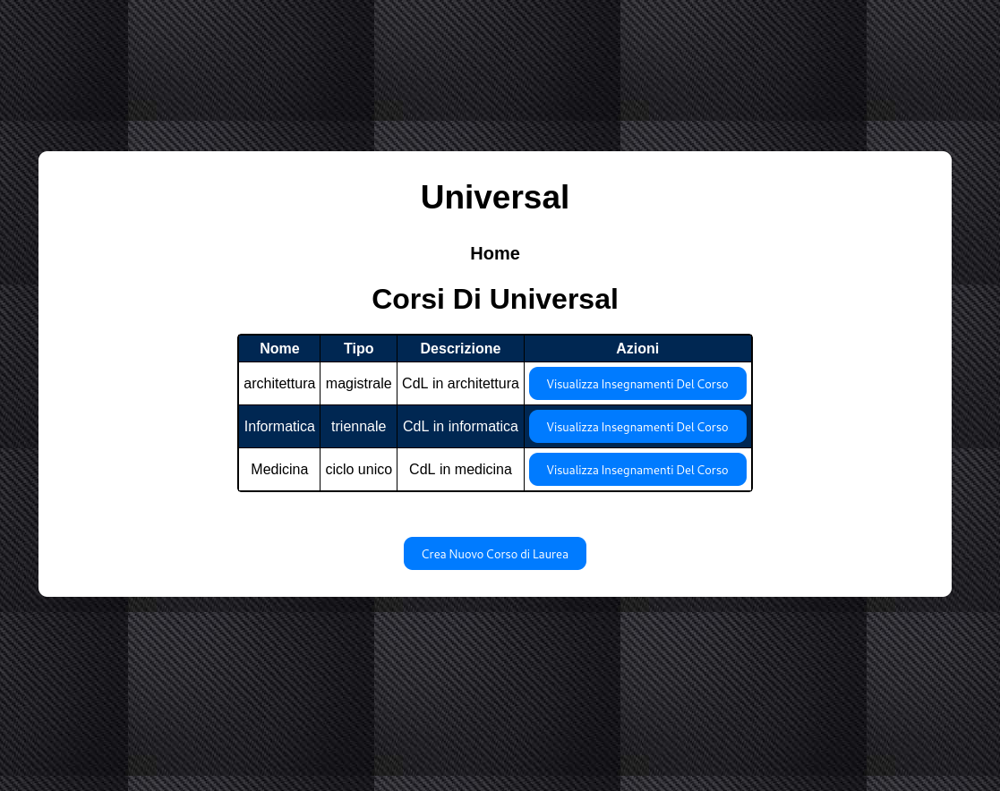
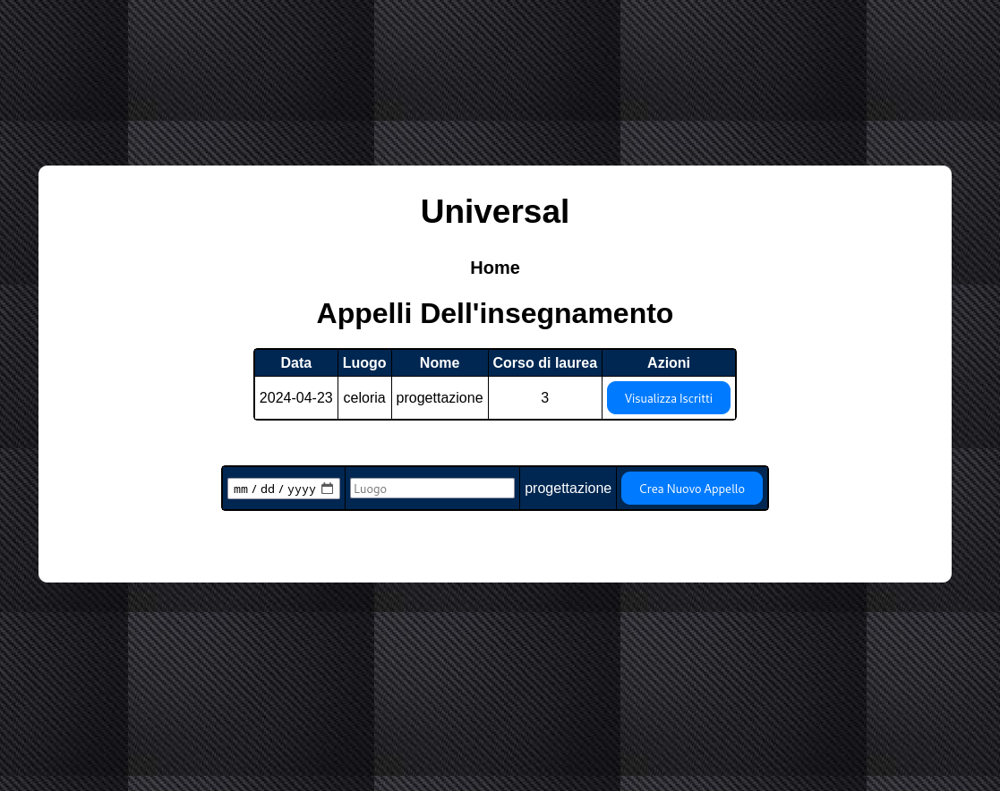
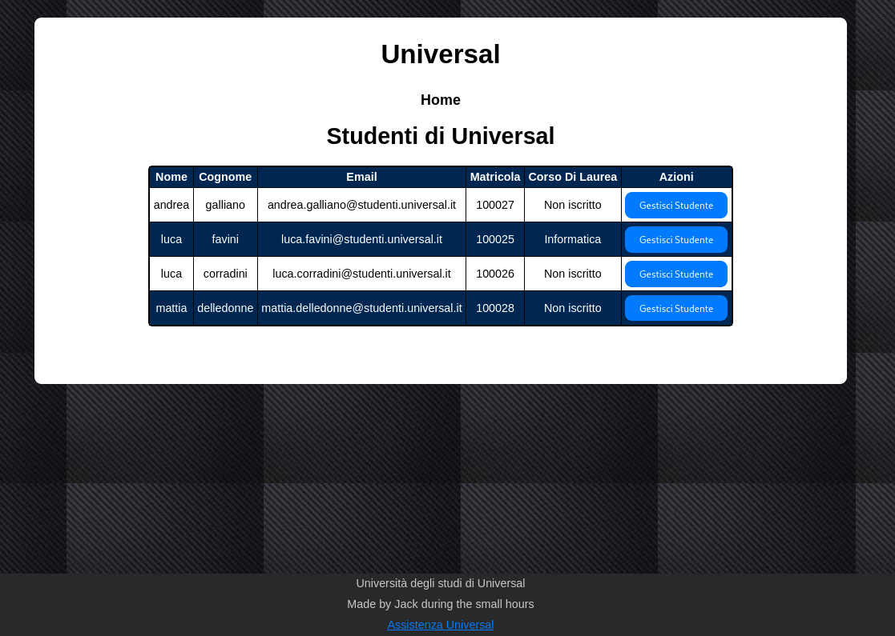
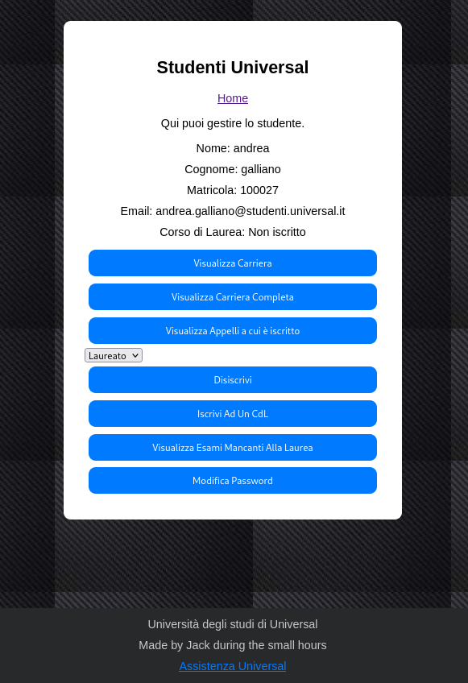

Giacomo Comitani, Matricola 986596

- [Database](#database)

- [Implementazioni Significative](#implementazioni-significative)

- [Funzioni Realizzate](#funzioni-realizzate)


# Database

Lo schema ER è disponibile cliccando [qui](ER.png)

Lo schema logico è disponibile cliccando [qui](./SchemaLogico.png)

# Implementazioni Significative

## Struttura webapp

La Webapp è composta da numerosi file `php` composti da una parte `HTML` che si occupa di dare struttura alla pagina, e una parte `php` che le conferisce delle funzionalità specifiche. Ecco un esempio di come ho gestito le funzionalità: 

```php
<?php
include '../scripts/db_connection.php';
session_start();

if (!isset($_SESSION['email'])) {
    header("Location: /login.php");
    exit();
}

if ($_SERVER["REQUEST_METHOD"] == "POST") {
    $vecchia_password = $_POST['old_password'];
    $nuova_password = $_POST['new_password'];

    $query_change_password = "CALL universal.change_password($1, $2, $3)";
    $result_change_password = pg_query_params($conn, $query_change_password, array($_SESSION['id'], $vecchia_password, $nuova_password));

    if (!$result_change_password) {
        echo '<script type="text/javascript">alert("Error: Errore durante il cambio password");</script>';
        exit;
    }

    echo '<script type="text/javascript">alert("Error: Password cambiata con successo"); </script>';
}
?>
```

da inserire descrizione di cose importanti dìsu come invoco le uery e come le gestisco


## Login

Il file login.php si occupa di gestire l'autenticazione degli utenti nel sistema. Quando un utente inserisce le sue credenziali e preme il pulsante di login, il sistema verifica se le credenziali sono corrette. Se sì, l'utente viene reindirizzato alla sua area personale in base al tipo di account (studente, ex-studente, docente o segretario). Se le credenziali sono errate, viene mostrato un messaggio di errore.

Una volta effettuato l'accesso al sistema, l'utente può usufruire delle diverse funzionalità disponibili, in base al suo tipo di account.

```php
if(isset($_POST["email"]) && isset($_POST["password"])) {
        $email = $_POST["email"];
        $password = $_POST["password"];
        $_SESSION['email'] = $email;
        
        $result = pg_query_params($conn, 'SELECT * FROM universal.utenti WHERE email = $1 AND password = crypt($2, password)', array($email, $password));

        if (pg_num_rows($result) == 1) {
            $query_get_id = "SELECT * FROM universal.get_id($1)";
            $result_get_id = pg_query_params($conn, $query_get_id, array($_SESSION['email']));
            $row_get_id = pg_fetch_assoc($result_get_id);
            $_SESSION['id'] = $row_get_id['id'];
            $type = Get_type($email);
            print_r($type);
            switch ($type){
                case "studenti":
                    header("Location: /progetto/webapp/studente/index.php");
                    exit();
                case "exstudenti":
                    header("Location: /progetto/webapp/ex_studente/index.php");
                    exit();
                case "docenti":
                    header("Location: /progetto/webapp/docente/index.php");
                    exit();
                case "segretari":
                    header("Location: /progetto/webapp/segreteria/index.php");
                    exit();
            }
        } else {
            echo '<script type="text/javascript">alert("Error: Credenziali errate!");</script>';
        }
    }
```

## Studente

Nel caso di uno studente, Questo verrà inizialmente reindirizzato alla seguente pagina: 


 Gli studenti possono accedere a numerose funzionalità, tra cui la visualizzazione degli esami mancanti per la laurea.

### Esami mancanti alla laurea

Uno studente può visualizzare gli esami mancanti alla laurea. 

```sql
CREATE OR REPLACE FUNCTION universal.get_missing_exams_for_graduation(_id uuid)
    RETURNS TABLE (
        nome VARCHAR(40),
        descrizione TEXT,
        anno INTEGER,
        docente_responsabile TEXT,
        corso_di_laurea INTEGER
    )
    LANGUAGE plpgsql
    AS $$
    BEGIN
        RETURN QUERY
        SELECT
            ins.nome,
            ins.descrizione,
            ins.anno,
            CONCAT(u.nome, ' ', u.cognome) AS nome,
            cdl.codice
        FROM universal.insegnamenti AS ins
        INNER JOIN universal.corsi_di_laurea AS cdl ON ins.corso_di_laurea = cdl.codice
        INNER JOIN universal.studenti AS s ON cdl.codice = s.corso_di_laurea
        LEFT JOIN universal.iscritti AS isc ON isc.insegnamento = ins.codice AND isc.studente = _id
        INNER JOIN universal.utenti AS u ON u.id = ins.docente_responsabile
        WHERE (isc.voto IS NULL AND isc.appello IS NOT NULL) OR (isc.appello IS NULL)
            AND cdl.codice = s.corso_di_laurea
        ORDER BY ins.nome;
    END;
$$;

```
Questa funzione restituisce gli esami mancanti per la laurea di uno studente identificato dal suo ID.

1. La funzione accetta un parametro `_id`, che rappresenta l'ID dello studente per il quale si vogliono ottenere gli esami mancanti.

2. Utilizzando il parametro `_id`, la funzione esegue una query SQL che seleziona le seguenti informazioni:
        - Il nome e la descrizione dell'esame mancante.
        - L'anno in cui è previsto l'esame.
        - Il nome completo del docente responsabile dell'esame.
        - Il codice del corso di laurea relativo all'esame.

3. La query include diverse operazioni di JOIN per collegare le tabelle `universal.insegnamenti`, `universal.corsi_di_laurea`, `universal.studenti`, `universal.iscritti` e `universal.utenti`, al fine di ottenere le informazioni necessarie sugli esami e sugli studenti.

4. Vengono applicati i seguenti criteri per determinare gli esami mancanti per la laurea dello studente:
        - L'esame deve essere associato al corso di laurea dello studente.
        - Lo studente non deve avere un voto registrato per l'esame.

5. Infine, la query ordina gli esami mancanti in base al loro nome.

La funzione restituisce una tabella contenente le informazioni sugli esami mancanti per la laurea dello studente specificato.

## Visualizza Carriera

Altra funzionalità degna di nota è quella che permette ad uno studente di visualizzare la propria carriera, ovvero l'elenco di tutti gli esami che ha conseguito e le relative valuazioni 

```sql
CREATE OR REPLACE FUNCTION universal.get_partial_carrer(_id uuid)
    RETURNS TABLE (
        nome VARCHAR(40),
        descrizione TEXT,
        anno INTEGER,
        data DATE,
        docente_responsabile TEXT,
        corso_di_laurea INTEGER,
        voto INTEGER
    )
    LANGUAGE plpgsql
    AS $$
    BEGIN
        RETURN QUERY
        SELECT DISTINCT ON (i.insegnamento)
            ins.nome,
            ins.descrizione,
            ins.anno,
            a.data,
            CONCAT(u.nome, ' ', u.cognome) AS docente_responsabile,
            ins.corso_di_laurea,
            i.voto
        FROM
            universal.iscritti i
            INNER JOIN universal.insegnamenti AS ins ON ins.codice = i.insegnamento
            INNER JOIN universal.appelli AS a ON i.appello = a.codice
            INNER JOIN universal.utenti AS u ON iNS.docente_responsabile = u.id
        WHERE
            i.studente = _id AND i.voto IS NOT NULL
        ORDER BY
            i.insegnamento,
            i.appello DESC;
    END;
$$;
```

Questa funzione restituisce una tabella contenente gli esami mancanti per la laurea di uno studente identificato dal suo ID.

La funzione sfrutta una query complessa per recuperare gli esami mancanti per la laurea dello studente.
    
- La funzione accetta un parametro `_id`, che rappresenta l'ID dello studente per il quale si vogliono ottenere gli esami mancanti.
- Utilizza una combinazione di JOIN tra le tabelle `universal.insegnamenti`, `universal.corsi_di_laurea`, `universal.studenti`, `universal.iscritti` e `universal.utenti` per ottenere le informazioni necessarie sugli esami e sugli studenti.
- Filtra gli esami mancanti in base ai seguenti criteri:
    - Lo studente deve essere iscritto al corso di laurea relativo all'esame.
    - Lo studente non deve avere un voto registrato per l'esame.
    - Deve essere disponibile almeno un appello per l'esame.
- Infine, ordina gli esami mancanti per nome.

## Iscrizioni agli esami 

Infine, uno studente può iscriversi ad un esame di un insegnamento del corso di laurea a cui è iscritto: 

```sql
CREATE OR REPLACE PROCEDURE universal.subscription(
    _id uuid,
    _appello INTEGER
)
LANGUAGE plpgsql
AS $$
BEGIN
    DECLARE
        codice_insegnamento INTEGER;
        data_appello DATE;
    BEGIN
        -- Ottieni l'insegnamento relativo all'appello specificato
        SELECT a.insegnamento, a.data INTO codice_insegnamento, data_appello
        FROM universal.appelli AS a
        WHERE a.codice = _appello;

        -- Controlla se la data dell'appello è diversa dalla data odierna
        IF data_appello = CURRENT_DATE THEN
            RAISE EXCEPTION 'Non è possibile iscriversi all''appello di oggi.';
        END IF;

        -- Inserisci l'iscrizione dello studente all'appello d'esame
        INSERT INTO universal.iscritti (appello, studente, insegnamento, voto)
        VALUES (_appello, _id, codice_insegnamento, NULL);
    END;
END;
$$;
```

Questa procedura gestisce l'iscrizione di uno studente a un determinato appello d'esame.

La procedura accetta due parametri:

- `_id`: l'ID dello studente che si vuole iscrivere all'appello.
- `_appello`: il codice dell'appello d'esame a cui lo studente si vuole iscrivere.

La procedura svolge i seguenti passaggi:

- Ottiene l'insegnamento associato all'appello specificato.
- Controlla se la data dell'appello è diversa dalla data odierna. In caso positivo, genera un'eccezione.
- Inserisce l'iscrizione dello studente all'appello d'esame nella tabella `universal.iscritti`, impostando il voto come NULL.

# Docenti

Gli utenti che si identificano come docenti hanno accesso a piu' funzioni rispetto a quelle accessibili agli studenti. Un docente che effettua il login al sistema viene reindirizzato inizialmente ala seguente pagina: 



I docenti possono modificare la propria password, e gestire gli insegnamenti di cui sono responsabili, visualizzandone gli appelli, creandone di nuovi, e visualizzare gli studenti iscritti agli appelli. Infine possono visualizzare un elenco delle valutazioni che hanno assegnato 

## visualizza valutazioni assegnate

```sql
CREATE OR REPLACE FUNCTION universal.get_teacher_grades(_id uuid)
    RETURNS TABLE (
        nome VARCHAR(40),
        cognome VARCHAR(40),
        matricola INTEGER,
        data DATE,
        luogo VARCHAR(40),
        insegnamento INTEGER,
        voto INTEGER
    )
    LANGUAGE plpgsql
    AS $$
    BEGIN
        RETURN QUERY
        SELECT
            u.nome,
            u.cognome,
            s.matricola,
            a.data,
            a.luogo,
            ins.codice,
            i.voto
        FROM
            universal.iscritti AS i
            INNER JOIN universal.utenti AS u ON i.studente = u.id
            INNER JOIN universal.insegnamenti AS ins ON i.insegnamento = ins.codice
            INNER JOIN universal.studenti AS s ON i.studente = s.id
            INNER JOIN universal.appelli AS a ON i.appello = a.codice
        WHERE
            i.voto IS NOT NULL AND  ins.docente_responsabile = _id -- Filtra solo gli insegnamenti di cui il docente è responsabile
            AND ins.docente_responsabile = _id -- Aggiungi questa condizione per filtrare solo gli insegnamenti del docente attualmente loggato
        ORDER BY matricola;
    END;
$$;
```

Questa funzione restituisce tutte le valutazioni assegnate da un docente agli studenti per gli insegnamenti di cui è responsabile.

Parametri:
- `_id`: l'ID del docente di cui si vogliono ottenere le valutazioni.

La funzione filtra solo le valutazioni non NULL, ovvero gli esami valutati, relativi agli insegnamenti di cui il docente è responsabile.

## Segretari

I segretari sono gli utenti con maggior potere all'interno del sistema, datoche lo possono gestire completamente.

Inizialmente vengono reindirizzati alla pagina iniziale della loro arera personale: 



Da qui un segretario puo' come di consueto modificare la propria password, ma amche gestire studenti e docenti. 

Ecco una lista delle principali funzionalita'

### Visualizzare tutti i corsi di laurea 

I segretari hanno la possibilita' di visualizzare tutti i corsi di laurea all'interno del sistema: 



Per ogni corso di laurea presente nel sistema un segretario e' in grado di : 

- visualizzare gli insegnamenti del corso 
- creare un nuovo corso di laurea 



Per ogn insegnamento invece, ogni segretario puo': 

- Visualizzare gli appelli dell'insegnamento
- modificare il responsabile dell'insegnamento
- visualizare, se presenti, le propedeuticita' dell'insegnamento 

Per ogni appello, un segretario puo' crearne di nuovio visualizzarne gli iscritti 



### Visualizzare tutti i docenti

I segretari hanno a disposizione una schermata da cui possono gestire tutti i docenti presenti nel sistema 


Da qui sono quindi in grado per ogni docente di : 

- Visualizzare i corsi di cui il docente e' responsabile 

- visualizzare tutte le valutazioni che ha assegnato 

- eliminare il docente dal sistema. In questo caso, il docente potra' essere eliminato solamente se non ci sono all'interno del sistema insegnamenti di cui e' responsabile 

- modificarne la password

### Visualizzare tutti gli studenti

I segretari hanno a disposizione una schermata da cui possono visualizzare tutti gli studenti presenti nel sistema



Inoltre, per ogni studente, hanno a disposizione numerose funzionalita' che gli permettono di gestirlo opportunamente. 



In particolare, per ogni studente un segretario e' in grado di : 

- Visualizzare la carriera
- Visualizzare la carriera completa
- Visualizzare gli apelli a cui e' iscritto 
- Iscrivere/disiscrivere uno studente ad un appello
- Disiscrivere uno studente da un corso di laurea ( `Laureato`, `Rinuncia`)
- Iscrivere uno studente ad un corso di laurea 
- Visualizzare gli esami mancabti alla laurea dello studente
- Modificare la password dello studente

### Visualizzare tutti gli ex studenti 

I segretari hanno a disposizione una schermata da cui possono visualizzare tutti gli studenti presenti nel sistema


### Visualizzare tutti i segretari

### Inserire un nuovo utente

# Funzioni Realizzate

## Funzioni

- `login`: verifica le credenziali dell'utente e ne restituisce il tipo e l'id
- `genera_matricola` : genera e ritorna il numero di matricola di uno studente 
- `get_all_students` : ritorna tutti gli studenti presenti nel sistema
- `get_all_exstudents` : ritorna tutti gli ex studenti presenti nel sistema
- `get_all_teachers` : ritorna tutti i docenti presenti nel sistema
- `get_id`: restituisce l'id dello studente a partire dai dati di autenticazione ? 
- `get_student` : restituisce uno studente dato il suo id
- `get_teacher`: restituisce un docente dato il suo id
- `get_ex_student` : restituisce un'ex studente dato il suo id 
- `get_secretary` : restituisce un segretario dato il suo id 
- `get_secretaries` : restituisce tutti i segretari presenti nel sistema 
- `get_degree_courses` : restituisce tutti i corsi di laurera presenti nel sistema 
- `get_degree_course` : restituisce un corso di laurea dato il suo codice 
- `get-email` : genera una nuova email per un utente. In caso di omonimia aggiunge un suffisso numerico incrementale alla fine del cognome dell'utente
- `get_teaching` : restituisce tutti gli insegnamenti presenti nel sistema
- `get_teaching_of-cdl` : dato il codice di un corso di laurea presente nel sistema, restituisce tutti gli insegnamenti del corso
- `get_exam-sessions` : dato il codice di un insegnamento, ne restituisce tutti gli appelli presenti nel sistema
- `get_all_exam-sessions` : restituisce tutti gli appelli di tutti gli insegnamenti presenti nel sistema 
- `get_student_exam_enrollments` : dato l'id di uno studente, restituisce tutti gli appelli a cui è iscritto 
- `get_exam_enrollments` : dato il codice di un appello, restituisce tutti gli studenti ad esso iscritti
- `get_grades` : dato il codice di un appello, restituisce tutte le valutazioni ad esso relative
- `get_grades_of_ex-students` : dato l'id di un ex studente, restituisce tutte le sue valutazioni
- `get_grades_of_ex_students` : restituisce tutte le valutazioni di tutti gli ex studenti presenti nel sistema 
- `get_missing_exams_for_graduation` : dato l'id di uno studente, restituisce gli esami che gli mancano al conseguimento della laurea a cui è iscritto 
- `get_teaching_activity_of_professor` : dato l'id di un docente, restituisce tutti gli insegnamenti di cui è responsabile
- `get_students_enrolled_in_teaching_appointments` : dato l'id di un docente, restituisce tutti gli studenti iscritti ad appelli degli insegnamenti di cui il docente è responsabile
- `get_teacher_grades` : dato l'id di un docente, restituisce tutte le valutazioni da lui assegnate
- `get_all_teaching_appointments_for_student_degree` : dato l'id di uno studente, restituisce tutti gli appelli di tutti gli insegnamenti del corso di laurea a cui è iscritto 
- `get_student_grades` : dato l'id di uno studente, restituisce tutte le sue valutazioni
- `get_student_average` : dato l'id di uno studente, restituisce la media delle sue valutazioni
- `get_all_cdl` : restituisce tutti i corsi di laurea presenti nel sistema 
- `get_partial_carrer` : dato l'id di uno studente, restituisce la sua carriera
- `get_propaedeutics` : dato il codice di un insegnamento, restituisce le sue propedeuticità
- `get_single_teaching` : dato il codice di un insegnamento, ne restituisce le informazioni associate
- `get_teaching_of_cdl_for_propaedeutics` : dato il codice di un corso di laurea e quello di un insegnamento del corso di laurea, restituisce tutti gli altri insegnamenti del corso di laurea
- `get_all_students_of_cdl` : dato il codice di un corso di laurea presente nel sistema, restituisce tutti gli studenti ad esso iscritto 

## Procedure

- `studentToExStudent` : trasforma uno studente in un ex studente, aggiornando correttamente le tabelle del sistema
- `insert_utente` : dato il nome, il cognome, la password e il tipo, inserisce un nuovo utente nel sistema
- `delete_utente` : dato l'id di un utente presente nel sistema, lo elimina
- `insert_degree_course` : inserisce un corso di laurea nel sistema 
- `insert_teaching` : inserisce un insegnamento nel sistema 
- `insert_exam_session` : inserisce un appello di un insegnamento presente nel sistema
- `subscription` : iscrive uno studente ad un appello 
- `insert_grade` : assegna una valutazione ad uno studente
- `subscribe_to_cdl` : iscrive uno studente ad un corso di laurea presente nel sistema 
- `change_password` : modifica la password di un utente presente nel sistema 
- `unsubscribe_from_exam_appointment` : disiscrive uno studente dall'appello di un insegnamento 
- `unsubscribe_from_exam_appointment` : disiscrive uno studente da un appello presente nel sistema 
- `unsubscribe_to-cdl` : disiscrive uno studente da un corso di laurea presente nel sistema 
- `create_exam_session` : crea un appello d'esame di un insegnamento
- `delete_exam_session` : cancella l'appello d'esame di un insegnamento
- `change_course_responsible_teacher` : modifica il docente responsabile di un insegnamento
- `change_secretary_office` : modifica la sede di un segretario 
- `delete_secretary` : elimina un segretario presente nel sistema 
- `delete_techer` : elimina un docente presente nel sistema 
- `insert_propaedeutics` : crea la propedeuticità per un'insegnamento

## Trigger

- `aggiorna_tabella` : inserisce le informazioni dell'utente creato nella tabella corretta, in base al tipo
- `elimina_utente_dopo_cancellazione` : elimina le informazioni dell'utente eliminato,  nella tabella `utenti`
- `check_number_of_session` : controlla che non ci sia piu di un appello nella stessa data per lo stesso corso di laurea
- `check_subscription_to_cdl` : controlla che uno studente non sia già iscritto ad un corso di laurea 
- `non_cyclic_prerequisites_check` : controlla che non ci siano propedeuticità cicliche 
- `check_instructor_course_limit`: controlla che il docente responsabile dell'insegnamento non sia giè responsabile di almeno tre insegnamenti
- `check_prerequisites_before_enrollment` : controlla che siano  rispettate le propedeuticità all'iscrizione ad un'appello.