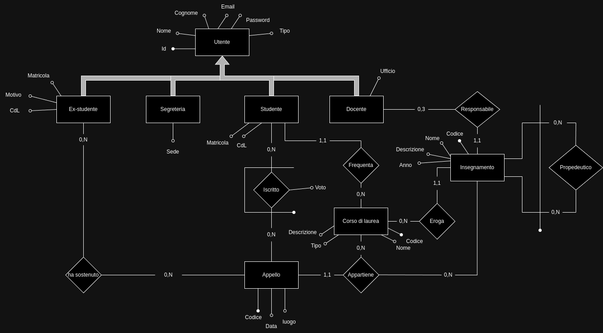
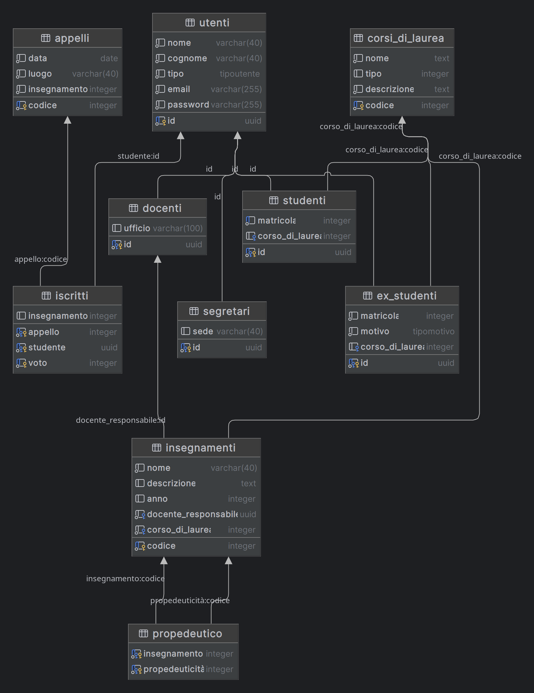

Giacomo Comitani, Matricola 986596

# Indice

- [Database](#database)

- [Implementazioni Significative](#implementazioni-significative)

    - [uuid](#uuid)
    - [password crittografate](#password-crittografate)
    - [Aggiornamento automatico delle relazioni tra le tabelle degli utenti](#aggiornamento-automatico-delle-relazioni-tra-le-tabelle-degli-utenti)
    - [genera email utente](#generazione-email-utente)
    - [eliminazione di uno studente](#eliminazione-di-uno-studente)
    - [storico valutazioni](#storico-delle-valutazioni)
    - [controllo propedeuticità](#controllo-delle-propedeuticità)
    - [struttura webapp](#struttura-webapp)
    - [login](#login)

- [Funzionalità Web App](#funzionalita-webapp)

    - [Studente](#studenti)
    - [Docente](#docenti)
    - [Segretario](#segretari)

- [Funzioni Realizzate](#funzioni-realizzate)


# Database

## Schema ER




- **utenti**: (id, nome, cognome, tipo, email, password)
- **docenti**: (id, ufficio)
- **studenti**: (id, matricola, corso_di_laurea)
- **segretari**: (id, sede)
- **ex_studenti**: (id, matricola, motivo, corso_di_laurea)
- **corsi_di_laurea**: (codice, nome, tipo, descrizione)
- **insegnamenti**: (codice, nome, descrizione, anno, docente_responsabile, corso_di_laurea)
- **appelli**: (codice, data, luogo, insegnamento)
- **iscritti**: (appello, studente, insegnamento, voto)
- **propedeutico**: (insegnamento, propedeuticità)

**Entità utente** :

Rappresenta un utente generico della base di dati, si divide nelle seguenti categorie:

- Studente
- Segreteria
- Docente
- Ex studente

L'entità utente contiene delle caratteristiche comuni a tutti gli utenti, come l'`id` e il `tipo`

- **Entità studente** :

lo studente ha una `matricola` univoca, ed è iscritto ad un corso di laurea. L'iscrizione dello studente al corso di laurea è gestito dalla segreteria. Lo studente può iscriversi a tutti gli appelli degli insegnamenti previsti dal corso di laurea a cui è iscritto. lo studente può essere iscritto solamente ad un corso di laurea contemporaneamente. I voti dello studente sono memorizzati nella tabella `iscritti`, dalla quale non verranno mai cancellati.

- **Entità docente** :

Il docente ha un'informazione di contorno, `ufficio`, ed è responsabile di al massimo tre `insegnamenti`.
l'assegnazione di un docente come responsabile di un insegnamento è gestita dalla segreteria, quindi alla sua creazione, l'entità docente non è responsabile di alcun corso. Dal momento in cui al docente vengono assegnati dei corsi, queesto può creare appelli, e gestire gli studenti iscritti a quest'ultimi.

- **Entità ex studente** :

Gli ex studenti sono studenti che hanno abbandonato il corso di studi a cui erano iscritti per uno dei seguenti motivi: 

- Rinuncia agli studi
- Conseguimento della laurea.

La conversione di uno studente in un ex studente viene gestita dalla segreteria. Gli ex studenti presenti nella base di dati possono visualizzare tutti le proprie valutazioni passate, in quanto la tabella `iscritti` funge anche da storico delle valutazioni.

- **Entità segretario** :

I segretari sono le entità che hanno maggior potere all'interno della base di dati. Hanno la `sede` come informazione di contorno, e sono in grado di gestire ogni tipo di utente. importante notare come un segretario non abbia la facoltà di eliminare se stesso.

- **Corso di laurea** :

L'entità rappresenta un corso di laurea all'interno dell'università. Possiede una serie di attributi quali una `descrizione`, un `codice` univoco, un `nome` ed un `tipo`, che ne specifica la durata in anni. I corsi di laurea non verranno mai cancellati dalla base di dati. 

- **Insegnamento** : 

Un insegnamento è identificato da un `codice` incrementale univoco, e possiede diversi attributi quali un `nome`, una `descrizione` ed un `anno`. L'insegnamento deve avere obbligatoriamente un docente responsabile, che si occupa di gestirne gli appelli.

- **Appello** :

Rappresenta l'appello d'esame di un certo insegnamento. È identificato da un codice univoco, una data, ed un luogo. Gli studenti possono iscriversi agli appelli solamente se appartengono  ad un insegnamento presente nel corso di laurea a cui sono iscritti, e suppongo che gli appelli non vengano mai eliminati. Gli studenti non possono iscriversi all'appello se la sua data è passata rispetto alla data odierna.  

- **Iscritti** :

la relazione contiene le iscrizioni degli studenti agli appelli, e le relative valutazioni, sospese o finali. Le valutazioni non vengono mai eliminate, per questo la relazione funge anche da storico delle valutazioni per studenti ed ex-studenti, e da storico delle valutazioni assegnate per i docenti.

- **Propedeuticità** : 

Uninsegnamento può o meno avere una o più propedeuticità, che devono essere rispettate da uno studente per permettergli di iscriversi ad un appello d'esame. Prima di validare l'iscrizione ad un appello da parte di uno studente, viene quindi verificato che le propedeuticità siano rispettate. Infine, nel momento ddell'assegnazione di una propedeuticità ad un insegnamento, viene controllato che non vi siano propedeuticità cicliche. 

## Schema logico



# Implementazioni Significative

## UUID

Nel progettare il sistema di gestione, ho optato per l'utilizzo degli `UUID`, o Universal Unique Identifier, come chiavi primarie per identificare gli utenti in modo univoco all'interno del sistema. Questa scelta è stata motivata da diversi vantaggi rispetto alle soluzioni tradizionali basate su codici numerici.

Gli `UUID` sono progettati per essere universalmente univoci, rendendo estremamente improbabile che due `UUID` generati da macchine diverse in momenti diversi siano identici. Questo assicura che ogni utente abbia un identificatore univoco nel sistema, eliminando il rischio di collisioni di chiavi primarie.

Oltre alla loro unicità, gli `UUID` offrono una maggiore sicurezza. Poiché non seguono uno schema prevedibile come i numeri incrementali, gli `UUID` sono meno vulnerabili agli attacchi basati sulla prevedibilità delle chiavi primarie.

Un altro vantaggio degli `UUID` riguarda la privacy degli utenti. Essi non forniscono alcuna informazione sulla sequenza o sull'ordine in cui sono stati generati, garantendo un certo livello di anonimato per gli utenti nel sistema. Questo è cruciale per preservare la privacy e la sicurezza delle informazioni degli utenti.

In conclusione, l'utilizzo di `UUID` come chiavi primarie per identificare gli utenti nel sistema offre una maggiore unicità, sicurezza e privacy rispetto alle soluzioni basate su codici numerici semplici

## Password crittografate

Un segretario, è in grado di inserire un nuovo utente all'interno del sistema, chiamando la seguente procedura: 

```sql
CREATE OR REPLACE PROCEDURE universal.insert_utente(
    nome VARCHAR(40),
    cognome VARCHAR(40),
    tipo TipoUtente,
    password VARCHAR(255)
)
LANGUAGE plpgsql
AS $$
DECLARE
    email VARCHAR(255);
    crypt_password VARCHAR(255);
BEGIN
    -- Verifica che la password soddisfi i vincoli prima della crittografia
    IF LENGTH(password) != 8 OR NOT (password ~ '.*[!@#$%^&*()-_+=].*') THEN
        RAISE EXCEPTION 'La password deve essere lunga 8 caratteri e contenere almeno un carattere speciale.';
    END IF;

    email := universal.get_email(nome, cognome, tipo);
    crypt_password := crypt(password, gen_salt('bf'));
    INSERT INTO universal.utenti (nome, cognome, tipo, email, password)
    VALUES (nome, cognome, tipo, email, crypt_password);
END;
$$;
```
Nel processo di inserimento di un nuovo utente nel sistema, ho implementato una procedura denominata `insert_utente`, la quale si occupa di diversi compiti, tra cui la crittografia delle password degli utenti prima di memorizzarle nel database. Questa crittografia è gestita tramite la funzione `crypt`, per sfruttare i seguenti passaggi:

- `Sicurezza dei dati sensibili`: Crittografare le password degli utenti prima di memorizzarle nel database è fondamentale per garantire la sicurezza dei dati sensibili. Utilizzando la funzione `crypt`, le password vengono trasformate in una stringa crittografata, rendendole inaccessibili anche agli amministratori di database.

- `Protezione contro accessi non autorizzati`: La crittografia delle password garantisce che, anche nel caso in cui il database venga compromesso, le password degli utenti rimangano al sicuro e non siano facilmente decifrabili dagli attaccanti. Questo aggiunge un ulteriore strato di protezione contro accessi non autorizzati al sistema.

- `Utilizzo di algoritmi robusti`: La funzione crypt utilizza algoritmi di crittografia robusti, come `Blowfish`, per crittografare le password. Questi algoritmi sono stati progettati per offrire un elevato livello di sicurezza e resistenza agli attacchi crittografici.

## Aggiornamento automatico delle relazioni tra le tabelle degli utenti

All'interno del sistema, ho implementato due trigger per gestire l'aggiornamento automatico delle relazioni tra le tabelle degli utenti principali (`Studenti`, `Docenti` e `Segretari`) e la tabella degli utenti stessi.

Il primo trigger, chiamato `aggiorna_tabella_trigger`, entra in azione dopo l'inserimento di un nuovo utente nella tabella `universal.utenti`. 

```sql
CREATE OR REPLACE FUNCTION aggiorna_tabella()
RETURNS TRIGGER AS $$
DECLARE
    new_matricola INTEGER;
BEGIN
    IF NEW.tipo = 'studente' THEN
        new_matricola := genera_matricola();
        INSERT INTO universal.studenti (id, matricola, corso_di_laurea)
        VALUES (NEW.id, new_matricola,NULL);
    ELSIF NEW.tipo = 'docente' THEN
        INSERT INTO universal.docenti (id, ufficio)
        VALUES (NEW.id, 'edificio 74');
    ELSIF NEW.tipo = 'segretario' THEN
        INSERT INTO universal.segretari (id, sede)
        VALUES (NEW.id, 'sede centrale');
    END IF;
    RETURN NEW;
END;
$$ LANGUAGE plpgsql;
```
Questo trigger valuta il tipo del nuovo utente inserito e aggiorna di conseguenza le tabelle correlate. Ad esempio, se viene inserito un nuovo studente, il trigger assegna una matricola al nuovo studente utilizzando la procedura `genera_matricola` e inserisce tutti i dati relativi allo studente nella tabella `universal.studenti`. Lo stesso vale per `docenti` e `segretari`, che vengono inseriti nelle rispettive tabelle `universal.docenti` e `universal.segretari`.

Il secondo trigger, denominato `elimina_utente_dopo_cancellazione`, entra in azione quando un utente viene eliminato da una delle tabelle degli utenti principali. 

```sql
CREATE OR REPLACE FUNCTION elimina_utente_dopo_cancellazione()
RETURNS TRIGGER AS $$
BEGIN
    DELETE FROM universal.utenti WHERE id = OLD.id;
    RETURN OLD;
END;
$$ LANGUAGE plpgsql;
```
Questo trigger si occupa di eliminare anche l'utente corrispondente dalla tabella `universal.utenti`. Ad esempio, se viene eliminato un docente dalla tabella `universal.docenti`, il trigger si assicura che l'utente associato venga cancellato anche dalla tabella degli utenti.

In questo modo, i trigger garantiscono che le relazioni tra le tabelle degli utenti principali e la tabella degli utenti rimangano sempre aggiornate e coerenti, automatizzando il processo di gestione e mantenendo l'`integrità dei dati` all'interno del sistema.

## Generazione email utente

All'interno del sistema, ho implementato la funzione `universal.get_email` per generare gli indirizzi email degli utenti in modo automatico. Questa funzione accetta come input il `nome`, il `cognome` e il `tipo` di utente e restituisce un'email univoca in base alle regole specificate.

```sql
 CREATE OR REPLACE FUNCTION universal.get_email(nome VARCHAR(255), cognome VARCHAR(255), tipo TipoUtente)
    RETURNS VARCHAR(100)
    LANGUAGE plpgsql
AS $$
DECLARE
    email_generata VARCHAR(255);
    suffix_count INT;
BEGIN
    SELECT COUNT(*)
    INTO suffix_count
    FROM universal.utenti
    WHERE utenti.nome = $1 AND utenti.cognome = $2;

    IF suffix_count > 0 THEN
        email_generata := nome || '.' || cognome || suffix_count || '@' ||
                           CASE
                               WHEN tipo = 'studente' THEN 'studenti.universal.it'
                               WHEN tipo = 'docente' THEN 'docenti.universal.it'
                               WHEN tipo = 'segretario' THEN 'segretari.universal.it'
                           END;
    ELSE
        email_generata := nome || '.' || cognome || '@' ||
                           CASE
                               WHEN tipo = 'studente' THEN 'studenti.universal.it'
                               WHEN tipo = 'docente' THEN 'docenti.universal.it'
                               WHEN tipo = 'segretario' THEN 'segretari.universal.it'
                           END;
    END IF;
    RETURN email_generata;
END;
$$;
```
Di seguito una spiegazione più dettagliata delle caratteristiche della funzione: 

- `Generazione automatica dell'email`: La funzione si occupa di generare automaticamente l'indirizzo email degli utenti in base al loro nome, cognome e tipo. Utilizzando queste informazioni, l'email viene costruita in modo coerente e standardizzato.

- `Gestione delle omonimie`: Nel caso di omonimie tra gli utenti, la funzione gestisce questa situazione inserendo un suffisso numerico incrementale nell'email dopo il cognome. Questo assicura che ogni indirizzo email sia univoco all'interno del sistema, anche in presenza di utenti con lo stesso nome e cognome.

- `Selezione del dominio dell'email`: A seconda del tipo di utente (`studente`, `docente` o `segretario`), la funzione seleziona automaticamente il dominio corretto per l'indirizzo email. Ad esempio, gli studenti riceveranno un'email con il dominio "studenti.universal.it", mentre i docenti avranno un'email con il dominio "docenti.universal.it".

In questo modo, la funzione `universal.get_email` semplifica il processo di generazione degli indirizzi email degli utenti all'interno del sistema, garantendo che ogni email sia univoca, coerente e conforme alle specifiche del sistema.

## Eliminazione di uno studente

Un segretario è in grado di eliminare un utente presente nel sistema, chiamando la procedura `universal.studentToExStudent`:
```sql
CREATE OR REPLACE PROCEDURE universal.studentToExStudent (
    _id uuid,
    _motivo TipoMotivo
)
LANGUAGE plpgsql
AS $$
DECLARE
    matricola_ex_studente INTEGER;
    cdl INTEGER;
    new_email TEXT;
    old_email TEXT;
BEGIN
    SELECT matricola INTO matricola_ex_studente
    FROM universal.studenti
    WHERE id = _id;

    SELECT corso_di_laurea INTO cdl
    FROM universal.studenti
    WHERE id = _id;

    SELECT email into old_email
    FROM universal.utenti AS u
    WHERE u.id = _id;

    -- Costruisci il nuovo indirizzo email dell'ex studente
    new_email := REPLACE(old_email, '@studenti.', '@exstudenti.');

    -- Aggiorna il tipo dell'utente a 'ex_studente' e modifica l'email
    UPDATE universal.utenti
    SET tipo = 'ex_studente', email = new_email
    WHERE id = _id;

    -- Elimina la riga associata all'ex studente dalla tabella degli ex studenti
    DELETE FROM universal.ex_studenti
    WHERE id = _id;

    -- Inserisce i dati dell'ex studente nella tabella degli ex studenti
    INSERT INTO universal.ex_studenti (id, motivo, matricola, corso_di_laurea)
    VALUES (_id, _motivo, matricola_ex_studente, cdl);

    -- Rimuove lo studente dalla tabella studenti
    DELETE FROM universal.studenti
    WHERE id = _id;

END;
$$;
```
La trasformazione di uno studente in un ex studente all'interno del sistema, comporta diversi passaggi che coinvolgono l'aggiornamento delle tabelle e la modifica dei dati dell'utente. Ecco una spiegazione più dettagliata della procedura:

- `Recupero dei dati dello studente`: La procedura inizia recuperando la `matricola` dello studente e il `corso di laurea` associato utilizzando l'`ID` dello studente passato come input.

- `Generazione della nuova email`: Viene generato un nuovo `indirizzo email` per l'ex studente sostituendo il dominio "`studenti.universal.it`" con "`exstudenti.universal.it`". Questo viene fatto utilizzando la funzione `REPLACE` per sostituire il suffisso del dominio nell'indirizzo email originale.

- `Aggiornamento dei dati dell'utente`: L'utente viene quindi aggiornato cambiando il suo tipo da "`studente`" a "`ex_studente`" e sostituendo l'indirizzo email con quello generato per gli ex studenti.

- `Inserimento dei dati nell'archivio degli ex studenti`: I dati dello studente vengono quindi inseriti nella tabella `universal.ex_studenti`, che funge da archivio per gli ex studenti. Questo include l'`ID` dello studente, la `matricola`, il `motivo` del passaggio allo stato di ex studente e il `corso di laurea` associato.

- `Rimozione dell'utente dalle tabelle degli studenti`: Infine, lo studente viene rimosso dalla tabella `universal.studenti`.

Questa procedura assicura che tutte le informazioni relative allo studente vengano correttamente aggiornate e archiviate quando diventa un ex studente, garantendo l'integrità e la coerenza dei dati nel sistema.

## Storico delle valutazioni

Nel sistema, le valutazioni degli studenti sono memorizzate nella relazione "`iscritti`". Questo significa che ogni voto che uno studente riceve durante la sua permanenza all'università rimane registrato, senza mai essere cancellato. Questo consente di mantenere un registro storico completo delle prestazioni degli studenti, sia durante il periodo in cui sono attivi che dopo aver lasciato l'università. Quindi, anche quando diventano ex studenti, le loro valutazioni rimangono intatte, fornendo un'istantanea accurata del loro rendimento accademico nel corso degli anni.


## controllo delle propedeuticità 

Per quanto riguarda il controllo delle propedeuticità degli insegnamenti, ho implementato due differenti trigger

- `Controllo delle propedeuticità prima dell'iscrizione`: Questo trigger viene attivato quando uno studente si iscrive a un esame. Il suo compito è assicurarsi che lo studente abbia soddisfatto tutte le propedeuticità necessarie per l'insegnamento a cui desidera iscriversi. Se una propedeuticità è richiesta per l'esame e lo studente non l'ha ancora completata, viene generato un errore e l'iscrizione dello studente non viene consentita.

```sql
-- CONTROLLA CHE L'ISCRIZIONE DI UNO STUDENTE AD UN APPELLO RISPETTI LE PROPEDEUTICITÀ
CREATE OR REPLACE FUNCTION check_prerequisites_before_enrollment()
RETURNS TRIGGER AS $$
DECLARE
    prereq_count INTEGER;
BEGIN
    -- Controlla se ci sono insegnamenti correlati all'appello che richiedono propedeuticità
    SELECT COUNT(*) INTO prereq_count
    FROM universal.propedeutico p
    WHERE p.insegnamento = NEW.insegnamento;

    -- Se ci sono propedeuticità richieste
    IF prereq_count > 0 THEN
        -- Controlla se lo studente soddisfa le propedeuticità necessarie
        SELECT COUNT(*) INTO prereq_count
        FROM universal.propedeutico p
        WHERE p.insegnamento = NEW.insegnamento
        AND p.propedeuticità NOT IN (
            SELECT i.insegnamento
            FROM universal.iscritti i
            WHERE i.studente = NEW.studente
        );

        -- Se lo studente non soddisfa le propedeuticità richieste, genera un errore
        IF prereq_count > 0 THEN
            RAISE EXCEPTION 'Lo studente non soddisfa le propedeuticità necessarie per questo appello.';
        END IF;
    END IF;

    RETURN NEW;
END;
$$ LANGUAGE plpgsql;
```
- `Controllo delle propedeuticità non cicliche`: Questo trigger si occupa di garantire che non ci siano cicli nelle propedeuticità degli insegnamenti. In altre parole, controlla che non ci siano loop o dipendenze circolari tra gli insegnamenti. Ad esempio, se l'insegnamento A richiede l'insegnamento B come propedeuticità, e l'insegnamento B richiede l'insegnamento A, si verifica una situazione ciclica. Se viene rilevata una ciclicità, il trigger genera un errore per prevenire situazioni indesiderate.

```sql
CREATE OR REPLACE FUNCTION non_cyclic_prerequisites_check()
RETURNS TRIGGER AS $$
DECLARE
    current_insegnamento_id INTEGER;
    propedeuticita_id INTEGER;
    is_cyclic BOOLEAN := FALSE;
BEGIN
    current_insegnamento_id := NEW.insegnamento;
    propedeuticita_id := NEW.propedeuticità;

    -- Verifica delle propedeuticità per rilevare ciclicità
    WHILE propedeuticita_id IS NOT NULL AND NOT is_cyclic LOOP
        IF current_insegnamento_id = propedeuticita_id THEN
            is_cyclic := TRUE;
        END IF;

        SELECT propedeuticità INTO propedeuticita_id
        FROM universal.propedeutico
        WHERE insegnamento = propedeuticita_id;
    END LOOP;

    IF is_cyclic THEN
        RAISE EXCEPTION 'Ciclicità rilevata tra le propedeuticità.';
    END IF;

    RETURN NEW;
END;
$$ LANGUAGE plpgsql;
```
## Struttura webapp

La Webapp è composta da numerosi file `php` composti da una parte `HTML` che si occupa di dare struttura alla pagina, e una parte `php` che le conferisce delle funzionalità specifiche. Per comprendere meglio la struttura dei file che compongono la web app, ecco un esempio di come ho implementato il cambio password:

```php
<?php
include '../scripts/db_connection.php';
session_start();

if (!isset($_SESSION['email'])) {
    header("Location: /login.php");
    exit();
}

if ($_SERVER["REQUEST_METHOD"] == "POST") {
    $vecchia_password = $_POST['old_password'];
    $nuova_password = $_POST['new_password'];

    $query_change_password = "CALL universal.change_password($1, $2, $3)";
    $result_change_password = pg_query_params($conn, $query_change_password, array($_SESSION['id'], $vecchia_password, $nuova_password));

    if (!$result_change_password) {
        echo '<script type="text/javascript">alert("Error: Errore durante il cambio password");</script>';
        exit;
    }

    echo '<script type="text/javascript">alert("Error: Password cambiata con successo"); </script>';
}
?>
```

```html
<!DOCTYPE html>
<html>
<head>
    <title>Modifica Password</title>
    <link rel="stylesheet" type="text/css" href="./changePassword.css">
</head>
<body>
    <div class="sfondo">
        <div class="contenitore">
            <div class="logo">
                    <a class="nav-link" id="uni" aria-current="page" href="/login.php">Universal</a>
                    <br>
                    <br>
                    <br>
            </div>
            <br>
            <br>
            <div class="home">
                    <a class="nav-link" id="home" aria-current="page" href="./index.php">Home</a>
            </div>
            <br>
            <br>
            <div class="titolo"><h3>Modifica Password</h3></div>
            <div class="modifica">
                <form method="POST" action="">
                    <div class="form-group">
                        <input id="old_password" class="form-control input-lg typeahead top-buffer-s" name="old_password" type="password" class="form-control bg-transparent rounded-0 my-4" placeholder="Old Password" aria-label="Email" aria-describedby="basic-addon1">
                        <br>
                        <input id="new_password" class="form-control input-lg pass" name="new_password" type="password" class="form-control  bg-transparent rounded-0 my-4" placeholder="New Password" aria-label="Username" aria-describedby="basic-addon1">
                        <br>
                        <button type="submit" class="btn btn-primary btn-lg btn-block">Change</button>
                    </div>
                </form> 
            </div>
        </div>
    </div>
    <footer>
        <div>
            Università degli studi di Universal
        </div>
        <div>
            Made by Jack during the small hours
        </div>
        <div>
            <a href="https://google.com">Assistenza Universal</a>
            <br>
        </div>
    </footer>
</body>
</html>
```

La pagina di modifica della password è fondamentale per garantire la sicurezza e il controllo degli account degli utenti. Quando un utente accede alla pagina, il sistema verifica immediatamente se la sessione è attiva. Se l'utente non ha effettuato l'accesso, viene reindirizzato alla pagina di login, proteggendo così l'accesso non autorizzato.

Una volta che l'utente è autenticato, può procedere con la modifica della password. Questo avviene tramite un semplice modulo HTML che richiede all'utente di inserire la `vecchia password` e la `nuova password` desiderata. Una volta inviato il modulo, i dati vengono elaborati tramite `PHP`. Questa parte del codice si occupa di connettersi al database e di eseguire la procedura `universal.change_password`. Questo passaggio garantisce che la nuova password venga correttamente memorizzata e associata all'account dell'utente.

È importante notare che il sistema è progettato con un'attenzione particolare alla sicurezza. Utilizzo il metodo `pg_query_params()` per eseguire le query SQL, il che protegge efficacemente dalle minacce di SQL injection.

Infine, il sistema fornisce un feedback all'utente sia in caso di successo che di errore. Se il cambio password va a buon fine, viene mostrato un messaggio di conferma. In caso contrario, viene visualizzato un messaggio d'errore.

Tutte le altre pagine della web app seguono un approccio simile nella struttura e nell'implementazione delle funzionalità.

## Login

Il file login.php si occupa di gestire l'autenticazione degli utenti nel sistema. Quando un utente inserisce le sue credenziali e preme il pulsante di login, il sistema verifica se le credenziali sono corrette. Se sì, l'utente viene reindirizzato alla sua area personale in base al tipo di account (studente, ex-studente, docente o segretario). Se le credenziali sono errate, viene mostrato un messaggio di errore.

Una volta effettuato l'accesso al sistema, l'utente può usufruire delle diverse funzionalità disponibili, in base al suo tipo di account.


```php
if(isset($_POST["email"]) && isset($_POST["password"])) {
        $email = $_POST["email"];
        $password = $_POST["password"];
        $_SESSION['email'] = $email;
        
        $result = pg_query_params($conn, 'SELECT * FROM universal.utenti WHERE email = $1 AND password = crypt($2, password)', array($email, $password));

        if (pg_num_rows($result) == 1) {
            $query_get_id = "SELECT * FROM universal.get_id($1)";
            $result_get_id = pg_query_params($conn, $query_get_id, array($_SESSION['email']));
            $row_get_id = pg_fetch_assoc($result_get_id);
            $_SESSION['id'] = $row_get_id['id'];
            $type = Get_type($email);
            print_r($type);
            switch ($type){
                case "studenti":
                    header("Location: /progetto/webapp/studente/index.php");
                    exit();
                case "exstudenti":
                    header("Location: /progetto/webapp/ex_studente/index.php");
                    exit();
                case "docenti":
                    header("Location: /progetto/webapp/docente/index.php");
                    exit();
                case "segretari":
                    header("Location: /progetto/webapp/segreteria/index.php");
                    exit();
            }
        } else {
            echo '<script type="text/javascript">alert("Error: Credenziali errate!");</script>';
        }
    }
```

# Funzionalita' webapp

## Studenti

Nel caso di uno studente, Questo verrà inizialmente reindirizzato alla seguente pagina: 


Da qui ogni studente ha a disposizione una serie di funzionalità: 

- Visualizzare tutti gli appelli del corso di laurea al quale è iscritto


- Visualizzare gli appelli di tutti i corsi presenti nel sistema 

- Visualizzare tutti i corsi di laurea e i rispettivi insegnamenti


- Visualizzare gli esami mancanti alla laurea 


- Visualizzare le iscrizioni attive agli esami 


- Visualizzare la propria carriera, intesa come l'inseme delle valutazioni finali ottenute per ogni esame dato


- Visualizzare la propria carriera completa, intesa come l'elenco di tutte le valutazioni ottenute per ogni esame dato, compresi tutti i tentativi 


# Docenti

Gli utenti che si identificano come docenti hanno accesso a piu' funzioni rispetto a quelle accessibili agli studenti. Un docente che effettua il login al sistema viene reindirizzato inizialmente ala seguente pagina: 


Le funzionalità a disposizione del docente sono le seguenti: 

- Modificare la propria password 


- Visualizzare gli insegnamenti di cui il docente è responsabile


- Per ogni insegnamento, visualizzarne gli appelli


- Per ogni appello, visualizzare gli studenti iscritti


- Assegnare una valutazione ad uno studente iscritto ad un appello

- creare un nuovo appello

- Visualizzare tutte le valutazioni assegnate 


## Segretari

I segretari sono gli utenti con maggior potere all'interno del sistema, dato che lo possono gestire completamente.

Inizialmente vengono reindirizzati alla pagina iniziale della loro arera personale: 


Da qui un segretario puo'come di consueto modificare la propria password, ma anche gestire studenti e docenti. 

Ecco una lista delle principali funzionalita':

- Visualizzare tutti i corsi di laurea 


- Visualizzare gli insegnamenti del corso 
- Creare un nuovo corso di laurea 


- Visualizzare gli appelli dell'insegnamento
- Modificare il responsabile dell'insegnamento
- Visualizzare, se presenti, le propedeuticita' dell'insegnamento 
- Creare nuovi appelli e visualizzarne gli studenti iscritti


- Visualizzare tutti i docenti


- Visualizzare i corsi di cui il docente e' responsabile 


- Visualizzare tutte le valutazioni che il docente ha assegnato 


- Eliminare il docente dal sistema. In questo caso, il docente potra' essere eliminato solamente se non ci sono all'interno del sistema insegnamenti di cui e' responsabile 
- Modificare la password del docente
- Visualizzare tutti gli studenti
- Visualizzare tutti gli studenti presenti nel sistema


Inoltre, per ogni studente, hanno a disposizione numerose funzionalita' che gli permettono di gestirlo opportunamente. 


In particolare, per ogni studente un segretario e' in grado di : 

- Visualizzare la carriera
- Visualizzare la carriera completa
- Visualizzare gli apelli a cui e' iscritto 
- Iscrivere/disiscrivere uno studente ad un appello
- Disiscrivere uno studente da un corso di laurea ( `Laureato`, `Rinuncia`)
- Iscrivere uno studente ad un corso di laurea 
- Visualizzare gli esami mancabti alla laurea dello studente
- Modificare la password dello studente

I segretari hanno a disposizione una schermata da cui possono visualizzare tutti gli ex studenti presenti nel sistema


I segretari possono poi visualizzare tutti i segretari presenti nel sistema 

>

Da notare che un segreatrio, nel caso sia l'ultimo presente nel sistema, non ha la possibilità di eliminare se stesso.

Infine, I segretari hanno la possibilità di inserire un nuovo utente all'interno del sistema, specificandone il nome, il cognome, il tipo e la password


# Funzioni Realizzate

## Funzioni

- `login`: verifica le credenziali dell'utente e ne restituisce il tipo e l'id
- `genera_matricola` : genera e ritorna il numero di matricola di uno studente 
- `get_all_students` : ritorna tutti gli studenti presenti nel sistema
- `get_all_exstudents` : ritorna tutti gli ex studenti presenti nel sistema
- `get_all_teachers` : ritorna tutti i docenti presenti nel sistema
- `get_id`: restituisce l'id dello studente a partire dai dati di autenticazione ? 
- `get_student` : restituisce uno studente dato il suo id
- `get_teacher`: restituisce un docente dato il suo id
- `get_ex_student` : restituisce un'ex studente dato il suo id 
- `get_secretary` : restituisce un segretario dato il suo id 
- `get_secretaries` : restituisce tutti i segretari presenti nel sistema 
- `get-email` : genera una nuova email per un utente. In caso di omonimia aggiunge un suffisso numerico incrementale alla fine del cognome dell'utente
- `get_teaching_of-cdl` : dato il codice di un corso di laurea presente nel sistema, restituisce tutti gli insegnamenti del corso
- `get_exam-sessions` : dato il codice di un insegnamento, ne restituisce tutti gli appelli presenti nel sistema
- `get_all_exam-sessions` : restituisce tutti gli appelli di tutti gli insegnamenti presenti nel sistema 
- `get_student_exam_enrollments` : dato l'id di uno studente, restituisce tutti gli appelli a cui è iscritto 
- `get_exam_enrollments` : dato il codice di un appello, restituisce tutti gli studenti ad esso iscritti
- `get_missing_exams_for_graduation` : dato l'id di uno studente, restituisce gli esami che gli mancano al conseguimento della laurea a cui è iscritto 
- `get_teaching_activity_of_professor` : dato l'id di un docente, restituisce tutti gli insegnamenti di cui è responsabile
- `get_teacher_grades` : dato l'id di un docente, restituisce tutte le valutazioni da lui assegnate
- `get_all_teaching_appointments_for_student_degree` : dato l'id di uno studente, restituisce tutti gli appelli di tutti gli insegnamenti del corso di laurea a cui è iscritto 
- `get_student_grades` : dato l'id di uno studente, restituisce tutte le sue valutazioni
- `get_student_average` : dato l'id di uno studente, restituisce la media delle sue valutazioni
- `get_all_cdl` : restituisce tutti i corsi di laurea presenti nel sistema 
- `get_partial_carrer` : dato l'id di uno studente, restituisce la sua carriera
- `get_propaedeutics` : dato il codice di un insegnamento, restituisce le sue propedeuticità
- `get_single_teaching` : dato il codice di un insegnamento, ne restituisce le informazioni associate
- `get_teaching_of_cdl_for_propaedeutics` : dato il codice di un corso di laurea e quello di un insegnamento del corso di laurea, restituisce tutti gli altri insegnamenti del corso di laurea
- `get_all_students_of_cdl` : dato il codice di un corso di laurea presente nel sistema, restituisce tutti gli studenti ad esso iscritto 

## Procedure

- `studentToExStudent` : trasforma uno studente in un ex studente, aggiornando correttamente le tabelle del sistema
- `insert_utente` : dato il nome, il cognome, la password e il tipo, inserisce un nuovo utente nel sistema
- `insert_degree_course` : inserisce un corso di laurea nel sistema 
- `insert_teaching` : inserisce un insegnamento nel sistema 
- `insert_exam_session` : inserisce un appello di un insegnamento presente nel sistema
- `subscription` : iscrive uno studente ad un appello 
- `insert_grade` : assegna una valutazione ad uno studente
- `subscribe_to_cdl` : iscrive uno studente ad un corso di laurea presente nel sistema 
- `change_password` : modifica la password di un utente presente nel sistema 
- `unsubscribe_from_exam_appointment` : disiscrive uno studente dall'appello di un insegnamento 
- `unsubscribe_from_exam_appointment` : disiscrive uno studente da un appello presente nel sistema 
- `create_exam_session` : crea un appello d'esame di un insegnamento
- `delete_exam_session` : cancella l'appello d'esame di un insegnamento
- `change_course_responsible_teacher` : modifica il docente responsabile di un insegnamento
- `change_secretary_office` : modifica la sede di un segretario 
- `delete_secretary` : elimina un segretario presente nel sistema 
- `delete_techer` : elimina un docente presente nel sistema 
- `insert_propaedeutics` : crea la propedeuticità per un'insegnamento

## Trigger

- `aggiorna_tabella` : inserisce le informazioni dell'utente creato nella tabella corretta, in base al tipo
- `elimina_utente_dopo_cancellazione` : elimina le informazioni dell'utente eliminato,  nella tabella `utenti`
- `check_number_of_session` : controlla che non ci sia piu di un appello nella stessa data per lo stesso corso di laurea
- `check_subscription_to_cdl` : controlla che uno studente non sia già iscritto ad un corso di laurea 
- `non_cyclic_prerequisites_check` : controlla che non ci siano propedeuticità cicliche 
- `check_instructor_course_limit`: controlla che il docente responsabile dell'insegnamento non sia giè responsabile di almeno tre insegnamenti
- `check_prerequisites_before_enrollment` : controlla che siano  rispettate le propedeuticità all'iscrizione ad un'appello.